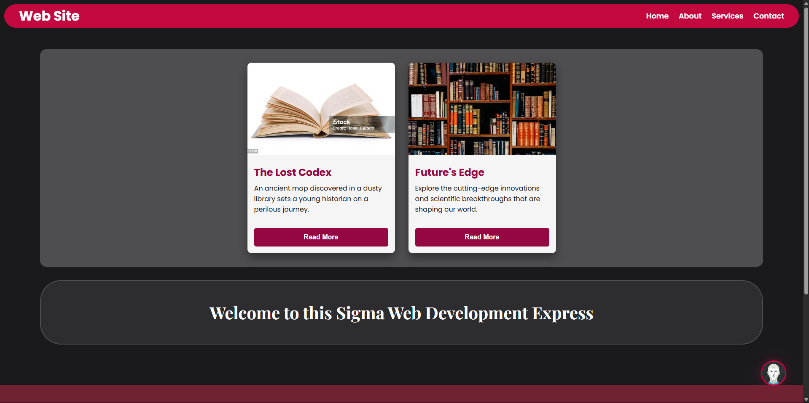

# Sigma Web Development - Exercise 5: CSS Page Layout Design

This repository contains my solution for Exercise 5 of the Sigma Web Development course. The challenge was to implement a complete webpage layout based on a design image, featuring a fixed header, multiple content sections, and a detailed footer.

---

## 🚀 Project Features & Concepts

This project demonstrates the ability to translate a visual design into a functional webpage using modern CSS techniques.

- **Fixed Navigation:** A "sticky" (fixed position) navbar that stays at the top of the page during scrolling for easy access.
- **Component-Based Design:** The page is built with reusable components like cards and a detailed footer.
- **Flexbox for Layout:** The layout heavily relies on Flexbox to center elements, create columns, and manage spacing effectively.
- **Advanced Positioning:** Uses `position: fixed` for the navbar and the floating logo, along with `z-index` to manage stacking order.
- **Custom CSS Variables:** The entire color scheme is managed by CSS custom properties for easy theming and maintenance.
- **Dynamic Animations:** On-load animations (`@keyframes`) and interactive hover effects are used throughout the page to create a dynamic user experience.
- **Multi-Section Footer:** A detailed, multi-column footer with social links and quick links.

## 🛠️ Tech Stack

- HTML5
- CSS3 (Flexbox, Animations, Custom Properties)
- JavaScript (for the auto-updating copyright year)

## 🙏 Acknowledgements

- This project is part of the **Sigma Web Development Course** by **CodeWithHarry**.
